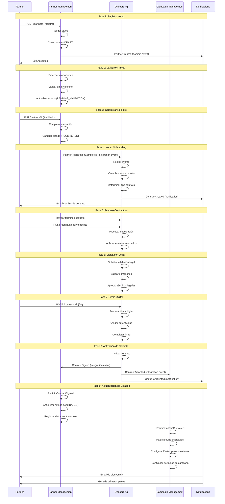
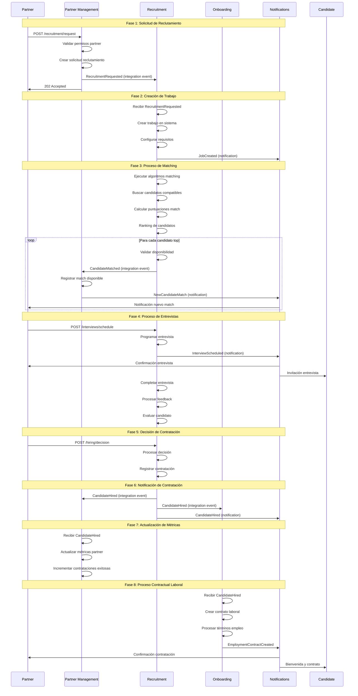
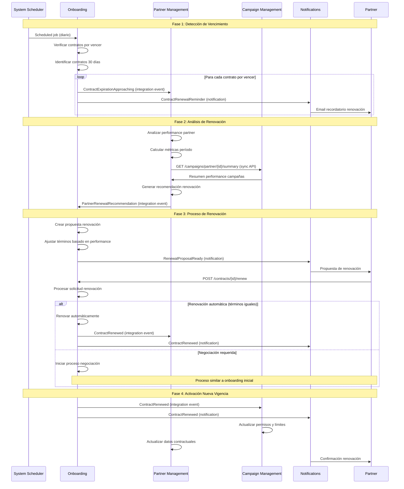

```mermaid
sequenceDiagram
    participant P as Partner
    participant CM as Campaign Management
    participant PM as Partner Management
    participant NT as Notifications
    participant AD as Ad Platforms

    Note over P, AD: Fase 1: Creación de Campaña
    P->>CM: POST /campaigns
    CM->>PM: GET /partners/{id}/permissions (sync API)
    PM->>CM: Partner permissions
    CM->>CM: Validar permisos creación
    CM->>CM: Crear campaña (DRAFT)
    CM->>P: 201 Created

    Note over P, AD: Fase 2: Configuración Avanzada
    P->>CM: PUT /campaigns/{id}/targeting
    CM->>CM: Configurar audiencias
    CM->>CM: Estimar alcance
    
    P->>CM: PUT /campaigns/{id}/budget
    CM->>CM: Asignar presupuesto
    CM->>CM: Configurar límites
    
    P->>CM: PUT /campaigns/{id}/creative
    CM->>CM: Subir creativos
    CM->>CM: Validar formatos

    Note over P, AD: Fase 3: Lanzamiento
    P->>CM: POST /campaigns/{id}/launch
    CM->>CM: Validar precondiciones
    CM->>CM: Activar campaña
    CM->>AD: Enviar a plataformas publicitarias
    CM->>NT: CampaignLaunched (notification)
    NT->>P: Confirmación lanzamiento

    Note over P, AD: Fase 4: Monitoreo en Tiempo Real
    loop Cada minuto
        AD->>CM: Métricas tiempo real
        CM->>CM: Procesar métricas
        CM->>CM: Actualizar dashboard
        CM->>P: WebSocket update
        
        CM->>CM: Verificar umbrales
        alt Umbral alcanzado
            CM->>PM: MetricThresholdReached (integration event)
            CM->>NT: CampaignAlert (notification)
            NT->>P: Alerta en tiempo real
        end
    end

    Note over P, AD: Fase 5: Optimización Automática
    CM->>CM: Detectar oportunidades optimización
    CM->>CM: Aplicar algoritmos avanzados para recomendaciones
    
    alt Optimización automática elegible
        CM->>CM: Aplicar optimización
        CM->>AD: Actualizar configuración
        CM->>NT: CampaignOptimized (notification)
        NT->>P: Notificación optimización
    else Optimización manual requerida
        CM->>NT: OptimizationSuggestion (notification)
        NT->>P: Sugerencia de optimización
    end

    Note over P, AD: Fase 6: Gestión Presupuestaria
    CM->>CM: Monitorear gasto
    CM->>CM: Calcular burn rate
    
    alt Presupuesto crítico
        CM->>PM: BudgetAlert (integration event)
        CM->>NT: BudgetAlert (notification)
        NT->>P: Alerta presupuestaria
        
        CM->>CM: Auto-pausar si configurado
        CM->>AD: Pausar campaña
    end

    Note over P, AD: Fase 7: Reporting Periódico
    CM->>CM: Generar reporte diario
    CM->>PM: CampaignPerformanceReport (integration event)
    CM->>NT: DailyReport (notification)
    
    PM->>PM: Actualizar métricas partner
    NT->>P: Reporte diario por email

    Note over P, AD: Fase 8: Finalización
    alt Campaña completada
        CM->>CM: Finalizar por cronograma
    else Pausada manualmente
        P->>CM: POST /campaigns/{id}/pause
        CM->>CM: Pausar campaña
    end
    
    CM->>CM: Generar métricas finales
    CM->>AD: Detener en plataformas
    CM->>PM: CampaignCompleted (integration event)
    CM->>NT: CampaignCompleted (notification)
    
    PM->>PM: Actualizar métricas finales
    NT->>P: Reporte final campaña
```

# Flujos de Eventos por Escenario - HexaBuilders

## 🎯 Visión General

Este documento describe los flujos completos de eventos para los principales escenarios de negocio en HexaBuilders, mostrando la secuencia temporal y las interacciones entre microservicios.

---

## 🔄 Escenario 1: Onboarding Completo de Partner

### **Descripción**
Un nuevo partner se registra en HexaBuilders y completa todo el proceso hasta poder crear campañas.

### **Actores**
- **Partner**: Nuevo usuario empresarial
- **Partner Management Service**: Gestión de partners
- **Onboarding Service**: Proceso contractual
- **Campaign Management Service**: Gestión de campañas
- **Notifications Service**: Notificaciones

### **Flujo Temporal Detallado**



### **Eventos Intercambiados**

| Orden | Evento | Tipo | Origen | Destino | Payload Principal |
|-------|--------|------|--------|---------|-------------------|
| 1 | `PartnerCreated` | Domain | Partner Management | Internal | `{partner_id, basic_info}` |
| 2 | `PartnerRegistrationCompleted` | Integration | Partner Management | Onboarding | `{partner_id, registration_data, partner_type}` |
| 3 | `ContractCreated` | Domain | Onboarding | Internal | `{contract_id, partner_id, terms}` |
| 4 | `ContractSigned` | Integration | Onboarding | Partner Management | `{contract_id, partner_id, signed_terms}` |
| 5 | `ContractActivated` | Integration | Onboarding | Campaign Management | `{contract_id, partner_id, permissions}` |

### **Métricas y SLAs**
- **Tiempo total estimado**: 2-5 días laborales
- **Tiempo crítico**: Registro a contrato creado < 30 minutos
- **SLA eventos críticos**: < 5 segundos
- **Tasa de éxito esperada**: > 85%

---

## 👥 Escenario 2: Proceso de Reclutamiento Completo

### **Descripción**
Un partner solicita reclutamiento de candidatos, se ejecuta el matching y se completa la contratación.

### **Flujo Temporal Detallado**



### **Eventos Intercambiados**

| Orden | Evento | Tipo | Origen | Destino | Payload Principal |
|-------|--------|------|--------|---------|-------------------|
| 1 | `RecruitmentRequested` | Integration | Partner Management | Recruitment | `{partner_id, job_requirements, urgency}` |
| 2 | `CandidateMatched` | Integration | Recruitment | Partner Management | `{match_id, candidate_id, match_score}` |
| 3 | `InterviewScheduled` | Domain | Recruitment | Internal | `{interview_id, candidate_id, datetime}` |
| 4 | `CandidateHired` | Integration | Recruitment | Partner Management, Onboarding | `{hiring_id, partner_id, candidate_id}` |

### **Métricas y SLAs**
- **Tiempo total estimado**: 1-3 semanas
- **Tiempo de matching**: < 24 horas
- **SLA notificaciones**: < 2 segundos
- **Tasa de éxito esperada**: > 70%

---

## 📊 Escenario 3: Ciclo de Vida de Campaña

### **Descripción**
Un partner validated crea, lanza y gestiona una campaña completa con optimización automática.

### **Flujo Temporal Detallado**



### **Eventos Intercambiados**

| Orden | Evento | Tipo | Origen | Destino | Payload Principal |
|-------|--------|------|--------|---------|-------------------|
| 1 | `CampaignCreated` | Domain | Campaign Management | Internal | `{campaign_id, partner_id, goals}` |
| 2 | `CampaignLaunched` | Domain | Campaign Management | Internal | `{campaign_id, launch_config}` |
| 3 | `MetricUpdated` | Domain | Campaign Management | Internal | `{campaign_id, metrics, timestamp}` |
| 4 | `BudgetAlert` | Integration | Campaign Management | Partner Management | `{campaign_id, budget_status, alert_level}` |
| 5 | `CampaignPerformanceReport` | Integration | Campaign Management | Partner Management | `{campaign_id, performance_data, period}` |
| 6 | `CampaignCompleted` | Integration | Campaign Management | Partner Management | `{campaign_id, final_metrics, success_indicators}` |

### **Métricas y SLAs**
- **Tiempo de lanzamiento**: < 5 minutos desde solicitud
- **Latencia métricas tiempo real**: < 30 segundos
- **SLA alertas críticas**: < 10 segundos
- **Disponibilidad dashboard**: > 99.5%

---

## 🔄 Escenario 4: Renovación de Contrato

### **Descripción**
Un contrato existente se acerca a su vencimiento y se ejecuta el proceso de renovación.

### **Flujo Temporal Detallado**



### **Eventos Intercambiados**

| Orden | Evento | Tipo | Origen | Destino | Payload Principal |
|-------|--------|------|--------|---------|-------------------|
| 1 | `ContractExpirationApproaching` | Integration | Onboarding | Partner Management | `{contract_id, expiration_date, days_remaining}` |
| 2 | `PartnerRenewalRecommendation` | Integration | Partner Management | Onboarding | `{partner_id, performance_data, recommendation}` |
| 3 | `ContractRenewed` | Integration | Onboarding | Partner Management, Campaign Management | `{contract_id, new_terms, effective_period}` |

---

## 📊 Métricas Globales de Flujos

### **Tiempos de Procesamiento Objetivo**

| Escenario | Tiempo Total | Tiempo Crítico | SLA Eventos |
|-----------|--------------|----------------|-------------|
| **Onboarding Completo** | 2-5 días | < 30 min | < 5s |
| **Reclutamiento** | 1-3 semanas | < 24h | < 2s |
| **Ciclo Campaña** | Variable | < 5 min | < 30s |
| **Renovación Contrato** | 3-7 días | < 1h | < 5s |

### **Patrones de Retry y Recuperación**

```yaml
retry_patterns:
  critical_events:
    max_retries: 5
    backoff: "exponential"  # 1s, 2s, 4s, 8s, 16s
    dlq_after: 5_failures
    
  business_events:
    max_retries: 3
    backoff: "linear"  # 2s, 2s, 2s
    dlq_after: 3_failures
    
  notification_events:
    max_retries: 10
    backoff: "fixed"  # 1s entre cada retry
    dlq_after: 10_failures
```

### **Monitoreo de Flujos**

```yaml
flow_monitoring:
  correlation_tracking:
    enabled: true
    retention_days: 30
    
  success_rate_alerts:
    onboarding_flow: "> 85%"
    recruitment_flow: "> 70%"
    campaign_flow: "> 95%"
    renewal_flow: "> 90%"
    
  latency_alerts:
    critical_events: "> 10s"
    business_events: "> 30s"
    notification_events: "> 5s"
```

---

Estos flujos proporcionan una guía completa para implementar, monitorear y mantener los procesos de negocio críticos en HexaBuilders, asegurando que todas las interacciones entre servicios sean robustas, observables y escalables.