# Matriz de Integración Entre Servicios - HexaBuilders

## 🎯 Visión General

Esta matriz define todas las integraciones entre los microservicios de HexaBuilders, especificando los mecanismos de comunicación, eventos intercambiados y dependencias entre servicios.

---

## 📊 Matriz de Comunicación

| Servicio Origen | Servicio Destino | Mecanismo | Evento/API | Propósito | Criticidad |
|----------------|------------------|-----------|------------|-----------|------------|
| **Partner Management** | Onboarding | Event (Async) | `PartnerRegistrationCompleted` | Iniciar proceso contractual | 🔴 Crítica |
| **Partner Management** | Recruitment | Event (Async) | `RecruitmentRequested` | Solicitar búsqueda de candidatos | 🟡 Media |
| **Partner Management** | Campaign Management | API (Sync) | `GET /partners/{id}/profile-360` | Obtener perfil para validación | 🟡 Media |
| **Onboarding** | Partner Management | Event (Async) | `ContractSigned` | Actualizar estado del partner | 🔴 Crítica |
| **Onboarding** | Campaign Management | Event (Async) | `ContractActivated` | Habilitar creación de campañas | 🔴 Crítica |
| **Onboarding** | Recruitment | Event (Async) | `EmploymentContractSigned` | Contrato laboral de candidato | 🟡 Media |
| **Recruitment** | Partner Management | Event (Async) | `CandidateMatched` | Notificar matches encontrados | 🟡 Media |
| **Recruitment** | Partner Management | Event (Async) | `CandidateHired` | Actualizar métricas de contratación | 🔴 Crítica |
| **Recruitment** | Onboarding | Event (Async) | `CandidateHired` | Iniciar proceso contractual laboral | 🟡 Media |
| **Campaign Management** | Partner Management | Event (Async) | `CampaignPerformanceReport` | Reportar métricas de campaña | 🟡 Media |
| **Campaign Management** | Partner Management | Event (Async) | `BudgetAlert` | Alertas presupuestarias | 🟠 Alta |
| **Campaign Management** | Recruitment | API (Sync) | `GET /candidates/search` | Buscar candidatos para campañas | 🟢 Baja |

---

## 🔄 Flujos de Integración Detallados

### **1. Flujo de Onboarding Completo**


**Eventos Intercambiados:**
1. `PartnerRegistrationCompleted` (PM → OB)
2. `ContractSigned` (OB → PM)
3. `ContractActivated` (OB → CM)

**Timeouts y Retry:**
- PartnerRegistrationCompleted: 30s timeout, 3 retries
- ContractSigned: 15s timeout, 5 retries
- ContractActivated: 20s timeout, 3 retries

### **2. Flujo de Reclutamiento**

```mermaid
sequenceDiagram
    participant PM as Partner Management
    participant RC as Recruitment
    participant OB as Onboarding

    PM->>RC: RecruitmentRequested
    RC->>RC: Crear trabajo
    RC->>RC: Ejecutar matching
    RC->>PM: CandidateMatched
    
    RC->>RC: Proceso entrevistas
    RC->>RC: Decisión contratación
    
    RC->>PM: CandidateHired
    RC->>OB: CandidateHired
    
    PM->>PM: Actualizar métricas
    OB->>OB: Contrato laboral
```



**Eventos Intercambiados:**
1. `RecruitmentRequested` (PM → RC)
2. `CandidateMatched` (RC → PM)
3. `CandidateHired` (RC → PM, OB)

### **3. Flujo de Gestión de Campañas**


**Eventos Intercambiados:**
1. `CampaignPerformanceReport` (CM → PM)
2. `BudgetAlert` (CM → PM, NT)
3. `CampaignStaffingRequest` (CM → RC)

---

## 🌐 APIs Síncronas

### **Partner Management APIs**

#### **Profile 360 API**
```http
GET /api/v1/partners-query/{partner_id}/profile-360
Authorization: Bearer {service_token}
X-Service-Name: campaign-management
```

**Usado por:**
- Campaign Management: Validar permisos de campaña
- Recruitment: Obtener contexto para matching
- Onboarding: Verificar datos para contrato

**Response Time SLA:** < 200ms
**Rate Limits:** 1000 req/min por servicio

#### **Partner Validation API**
```http
GET /api/v1/partners-query/{partner_id}/validation-status
Authorization: Bearer {service_token}
```

**Usado por:**
- Campaign Management: Verificar antes de lanzar campañas
- Onboarding: Validar estado antes de contrato

### **Recruitment APIs**

#### **Candidate Search API**
```http
POST /api/v1/candidates/search
Content-Type: application/json
Authorization: Bearer {service_token}

{
  "skills": ["JavaScript", "React"],
  "experience_years": {"min": 3, "max": 8},
  "location": "Remote",
  "availability": "AVAILABLE"
}
```

**Usado por:**
- Campaign Management: Buscar candidatos para roles de campaña
- Partner Management: Servicios de matching para partners

**Response Time SLA:** < 500ms
**Rate Limits:** 100 req/min por servicio

### **Campaign Management APIs**

#### **Campaign Metrics API**
```http
GET /api/v1/campaigns-query/{campaign_id}/metrics/real-time
Authorization: Bearer {service_token}
X-Time-Range: last_24h
```

**Usado por:**
- Partner Management: Dashboard de métricas de partner

**Response Time SLA:** < 100ms (cached)
**Rate Limits:** 500 req/min por servicio

---

## 🔒 Autenticación y Autorización

### **Service-to-Service Authentication**
```yaml
# JWT Service Tokens
authentication:
  type: "service_jwt"
  issuer: "hexabuilders-auth-service"
  audience: "{target_service}"
  claims:
    - service_name: "{calling_service}"
    - permissions: ["{permission_list}"]
    - expires_in: 3600  # 1 hour

# Example
{
  "iss": "hexabuilders-auth-service",
  "aud": "partner-management",
  "sub": "campaign-management-service",
  "permissions": [
    "partners:read",
    "partners:profile_360"
  ],
  "exp": 1704067200
}
```

### **Permission Matrix**
| Servicio | Puede Acceder A | Permisos |
|----------|----------------|----------|
| **Onboarding** | Partner Management | `partners:read`, `partners:update_status` |
| **Recruitment** | Partner Management | `partners:read`, `partners:metrics_update` |
| **Campaign Management** | Partner Management | `partners:read`, `partners:profile_360` |
| **Campaign Management** | Recruitment | `candidates:search`, `jobs:read` |
| **Partner Management** | Recruitment | `recruitment:request`, `jobs:create` |
| **Partner Management** | Campaign Management | `campaigns:read`, `campaigns:metrics` |

---

## 📈 Monitoreo y Observabilidad

### **Circuit Breakers**
```yaml
circuit_breakers:
  partner_management_api:
    failure_threshold: 10
    timeout: 30s
    fallback: "cached_response"
    
  recruitment_search_api:
    failure_threshold: 5
    timeout: 10s
    fallback: "empty_results"
    
  campaign_metrics_api:
    failure_threshold: 8
    timeout: 5s
    fallback: "stale_cache"
```

### **Health Checks Cross-Service**
```http
# Partner Management health check from Campaign Management
GET /health/dependencies
{
  "dependencies": {
    "partner_management": {
      "status": "healthy",
      "response_time_ms": 45,
      "last_check": "2025-01-15T10:30:00Z"
    },
    "recruitment": {
      "status": "degraded", 
      "response_time_ms": 850,
      "last_check": "2025-01-15T10:30:00Z",
      "error": "High latency detected"
    }
  }
}
```

### **Correlation ID Tracing**
```yaml
# Propagación de Correlation ID
correlation_id_flow:
  - origin: "partner-management"
    event: "PartnerRegistrationCompleted"
    correlation_id: "CORR-123-456-789"
    
  - destination: "onboarding"
    handler: "on_partner_registration_completed"
    correlation_id: "CORR-123-456-789"
    
  - child_events:
    - "ContractCreated": "CORR-123-456-789-1"
    - "LegalValidationRequested": "CORR-123-456-789-2"
```

---

## 🚨 Error Handling y Resilencia

### **Dead Letter Queues**
```yaml
dead_letter_config:
  partner_management_dlq:
    max_retries: 3
    retry_delay: "exponential"  # 1s, 2s, 4s
    dlq_topic: "hexabuilders/partner-management/dead-letters"
    
  recruitment_dlq:
    max_retries: 5
    retry_delay: "linear"  # 2s, 2s, 2s, 2s, 2s
    dlq_topic: "hexabuilders/recruitment/dead-letters"
```

### **Compensation Patterns**
```yaml
# Saga pattern para flujos complejos
partner_onboarding_saga:
  steps:
    1. "CreateContract"
    2. "ValidateLegal"
    3. "ProcessSignature"
    4. "ActivateContract"
    5. "EnableCampaigns"
    
  compensation:
    "EnableCampaigns": "DisableCampaigns"
    "ActivateContract": "DeactivateContract" 
    "ProcessSignature": "InvalidateSignature"
    "ValidateLegal": "RejectValidation"
    "CreateContract": "CancelContract"
```

### **Fallback Strategies**
| Integración | Fallback Strategy | Degraded Functionality |
|-------------|-------------------|------------------------|
| PM → OB (PartnerRegistrationCompleted) | Queue for retry | Onboarding retrasado 24h |
| RC → PM (CandidateHired) | Store & forward | Métricas actualizadas en batch |
| CM → PM (CampaignPerformanceReport) | Cache last known | Dashboard con datos de hace 1h |

---

## 📊 SLAs y Métricas

### **Service Level Agreements**
| Integración | Disponibilidad | Latencia P95 | Throughput |
|-------------|----------------|--------------|------------|
| **Eventos Críticos** | 99.9% | < 100ms | 1000 events/min |
| **APIs Síncronas** | 99.5% | < 200ms | 500 req/min |
| **Reportes Batch** | 99.0% | < 30s | 100 reports/hour |

### **Alertas Automáticas**
```yaml
alerts:
  high_latency:
    condition: "p95_latency > 500ms"
    duration: "5 minutes"
    action: "page_on_call_engineer"
    
  event_processing_lag:
    condition: "event_lag > 30s"
    duration: "2 minutes" 
    action: "auto_scale_consumers"
    
  api_error_rate:
    condition: "error_rate > 5%"
    duration: "1 minute"
    action: "trigger_circuit_breaker"
```

---

Esta matriz de integración proporciona una guía completa para implementar, monitorear y mantener todas las comunicaciones entre los microservicios de HexaBuilders, asegurando robustez, observabilidad y escalabilidad del sistema.